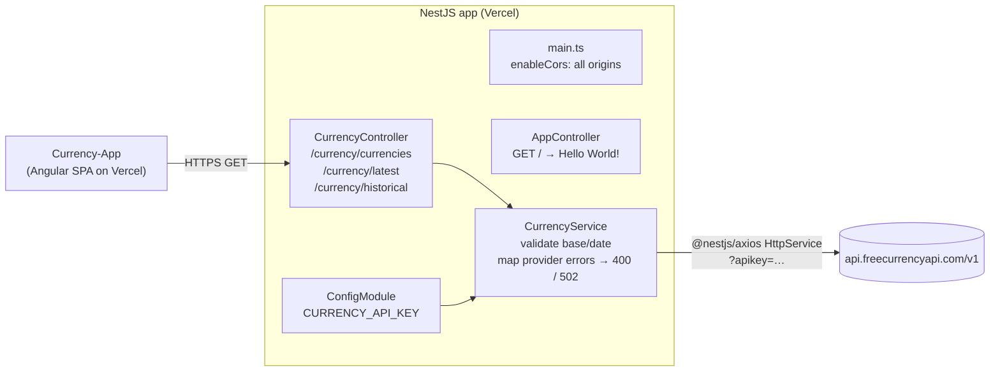

# Currency Backend API

[](https://github.com/Sami123d/Currency-Backend-Api/actions/workflows/ci.yml)

A small NestJS 11 API that proxies [freecurrencyapi.com](https://freecurrencyapi.com) so the API key stays on the server. It serves the currency list, latest rates and historical rates to the Angular frontend, [Currency-App](https://github.com/Sami123d/Currency-App).

**Deployed at:** https://currency-backend-api.vercel.app. On 2026-09-27, `/currency/currencies`, `/currency/latest` and `/currency/historical` all returned live data. The root path returns `Hello World!` and works as a basic liveness check.


## Status

Working and deployed. It is a thin proxy with input validation and error mapping. There is no database, no auth, no caching and no rate limiting.

## Architecture



Request flow: the controller reads the query parameters and `CurrencyService` checks them. It then calls the matching freecurrencyapi.com v1 endpoint with the `apikey` query parameter and returns the provider's JSON body without changing it.

## API reference

No endpoint needs authentication. CORS is enabled for all origins (`app.enableCors()`).

| Method | Path | Query | Purpose | Upstream call |
| --- | --- | --- | --- | --- |
| GET | `/` | none | Liveness check, returns `Hello World!` | none |
| GET | `/currency/currencies` | none | Supported currencies (code, name, symbol, decimals) | `GET /v1/currencies` |
| GET | `/currency/latest` | `base` (optional, 3-letter code, case-insensitive; the provider defaults to USD) | Latest rates for `base` | `GET /v1/latest?base_currency=` |
| GET | `/currency/historical` | `base` (optional), `date` (optional, `YYYY-MM-DD`; the provider defaults to yesterday) | Rates for `base` on `date` | `GET /v1/historical?base_currency=&date=` |

Example responses (provider format, passed through unchanged):

```jsonc
// GET /currency/latest?base=USD
{ "data": { "EUR": 0.8779, "GBP": 0.7549, "INR": 95.828, ... } }

// GET /currency/historical?base=USD&date=2025-01-02
{ "data": { "2025-01-02": { "EUR": 0.9738, "GBP": 0.8077, ... } } }
```

Errors:

| Status | When |
| --- | --- |
| 400 | `base` is not a 3-letter code, `date` is not `YYYY-MM-DD`, or the provider rejected the input (400/422), for example an unknown currency or a future date. The provider's message is passed on (currently `"Validation error"`). |
| 502 | The provider call failed for another reason: invalid or missing API key, quota, provider 5xx, or a network error. |

> Before this change, provider errors (for example `?base=XYZ`) came back as a generic `500 Internal server error`.

**Swagger:** not added. The endpoint surface is three GET routes, and serving Swagger UI's static assets from a Vercel serverless function tends to break. The table above is the reference.

## Tech stack

NestJS 11 (Express platform), `@nestjs/config`, `@nestjs/axios` (axios), RxJS, TypeScript. Tests use Jest, ts-jest and Supertest. Deployed on Vercel.

## Environment variables

| Name | Required | Purpose |
| --- | --- | --- |
| `CURRENCY_API_KEY` | yes | freecurrencyapi.com API key, sent as the `apikey` query parameter |
| `PORT` | no | Local listen port (default `3000`) |

Copy `.env.example` to `.env` for local development. `ConfigModule` loads it.

## Getting started

```bash
npm install
cp .env.example .env   # add your freecurrencyapi.com key
npm run start:dev      # http://localhost:3000
curl "http://localhost:3000/currency/latest?base=EUR"
```

## Testing

```bash
npm test          # unit: CurrencyService with HttpService/ConfigService mocked
npm run test:e2e  # e2e: real AppModule over HTTP (Supertest), HttpService overridden
```

No test calls the real provider.

- **Unit tests (`src/currency/currency.service.spec.ts`)** check the upstream URL, API key and parameter mapping, that `base` is upper-cased, that malformed input is rejected before any upstream call, and that errors are mapped (422 to 400 with the provider message, 401 or network errors to 502).
- **E2E tests (`test/app.e2e-spec.ts`)** send requests through the real routing, check the passed-through payloads, and check the 400 and 502 responses.

CI runs lint, build, unit and e2e tests on every push and PR.

## Deployment

The API is deployed on Vercel. There is no `vercel.json`: Vercel detects the NestJS project and runs `src/main.ts`. `CURRENCY_API_KEY` is set in the Vercel project settings. Pushing to `master` triggers a deploy.

## Roadmap

- Cache the currency list and daily rates. The data changes slowly, and caching would cut provider quota use.
- Restrict CORS to the frontend origin.
- Add a proper health endpoint in place of the `Hello World!` root.
